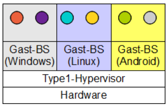

# Einführung in Betriebssysteme

## Was macht ein Betriebssystem?

Betriebssystem soll dem Anwendungsentwickler ein "einfaches und klares Modell" eines Computers zur Verfügung stellen.

Erkennungsmerkmal des Betriebssystems: Es läuft im Kernmodus.

# Aufgaben des Betriebssystems

1. Abstraktion der Hardware:

   - Betriebssystem stellt Funktionen bereit, um Hardware zu nutzen.
     - Anwender sieht bspw. nur "Festplatte".
   - Einheitliche Sicht für Anwendungen:
     - Digitalkamera und CD werden gleich verwaltet
   - :bulb: Betriebssystem realisiert eine "Virtuelle Maschine"

2. Verwaltung der Ressourcen:
   - Anwendung braucht Ressourcen für Ausführung
   - Im Mehrprozess- und Mehrbenutzerbetrieb laufen mehrere Anwendungen "gleichzeitig"
   - :bulb: Betriebssystem verteilt Ressourcen gerecht und sichert die Anwendungen und Benutzer gegeneinander
     - Zeitliches Multiplexing: CPU ("einer nach dem anderen")
     - Räumliches Multiplexing: Arbeitsspeicher ("ein Teil für dich, ein Teil für mich")

### :arrow_right: Betriebssystem ist "Mittler" zw. Anwendung und Hardware

Anwendungen können nicht direkt auf Hardware zugreifen :arrow_right: Sicherheit (als Nebenprodukt der Verwaltung)

# Überblick Computer-Hardware

Betriebssystem <u><b>muss</b></u> Details der Hardware kennen

## CPU

- Gehirn des Computers
- Unterschiedliche CPU-Typen haben unterschiedliche Menge von Befehlen
- Laden von Befehlen dauert länger als Ausführung
  - Optimierung durch Register
  - Ganzzahl-, Gleitkomma-Register
  - Spezialregister:
    - Befehlszähler (Program Counter PC)
    - Kellerregister (stack pointer)
    - Programmstatuswort (Program Status Word, PSW)
- Verwaltung durch Multiplexing
  - Zeitliche Aufteilung
  - Betriebssystem muss alle Register kennen
- Moderne Prozessoren können mehrere Befehle zur gleichen Zeit ausführen

### Ausführungsmodi

Durch diese Maßnahme wird der direkte Zugriff auf die Systemressourcen durch Anwendungsprogramme unterbunden. Der Modus wird durch Bit im PSW gesetzt

- System-/Kern-Modus (kernel mode)
  - Jeder Befehl des Befehlssatzes kann ausgeführt werden
  - Hardware kann komplett ausgenutzt werden
- Benutzermodus (user mode)
  - Eingeschränkter Zugriff
  - Speicher nur über Speicherverwaltung

#### Systemaufruf (system call, TRAP)

Kontrollierter Moduswechsel. Ein Anwendungsprogramm kann über das Betriebssystem auf die Hardware zugreifen.

Bei Ausführung eines Systemaufrufs:

1. Prozessor sichert Programm Counter im Keller (Rückkehradresse)
2. Umschalten in Systemmodus ("BS geht auf die CPU")
3. Verzweigung an vordefinierte Adresse im BS
4. BS analysiert Art des Systemaufrufs und führt den Aufruf aus
5. Rückkehrbefehl schaltet wieder in den Benutzermodus

:bulb: Auch andere Unterbrechungen erfordern das BS zu handeln, diese Unterbrechungen zu lösen:

- Interrupts (durch Hardware erzeugt)
- Exceptions (durch Programmfehler)

### Entwicklung der Prozessoren geht weiter

- Multi-Threading
  - Mehrere Threads in einem Prozessor mit schnellem Umschalten (in Nanosekunden)
  - _keine_ wirkliche Parallelität
- Multi-Core
  - Eigene unabhängige Prozessoren

## Speicher

Zugriffszeiten sind gegenläufig mit der Kapazität (Großer Speicher = langsame Zugriffszeit)

Die verschiedenen Komponenten werden durch das Betriebssystem verwaltet. Dabei wird die Speicherverwendung unter anderem durch Cache-Verfahren optimiert.

Bei transientem (flüchtigem) Speicher gehen die Daten beim Ausschalten verloren. Bei persistentem (dauerhaftem) Speicher hingegen nicht.

### Register, Cache

- Sehr nahe an der Prozessoreinheit

### RAM (Random Access Memory)

- Arbeitstier des Speichersystems
- "Was der Cache nicht kann, macht der RAM!"

### Festplatte

- Ermöglichen "Virtuellen Speicher"
- Lasse Programme laufen, die größer als der physische Speicher sind
- Verschiedene Zugriffszeiten (bspw. HDD vs. SSD)
  - Hardwareunterstützung durch MMU auf CPU
  - MMU = Memory Management Unit

### Magnetbänder

- Sicherungsmedium für Festplatten
- Speicher sehr großer Datenmengen
- Externes Ein-/Ausgabegerät

## Ein-/Ausgabe-Geräte

- Integration in Computer durch Controller-Ansatz
- Bietet vereinfachte Schnittstelle an
- Spezielle Hardware, oft mit eigenem Mikroprozessor
  - Steuert das Gerät (weitestgehend autonom)
  - Kann Interrupts senden
- Geräte-Treiber:
  - Software, die mit dem Controller kommuniziert
  - muss im Kernmodus laufen, daher Teil des BS sein!
- Sind direkt an die CPU angebunden
- Speicher-basierte E/A:
  - Register des Controllers sind im Speicheradressraum
  - normale Schreib-/Lesebefehle
  - Zugriffsschutz durch MMU
- Separater E/A-Adressraum
  - Zugriff auf Controller-Register nur über spezielle (privilegierte) E/A-Befehle

:bulb: Sowohl Speicherbasierte E/A als auch die Separaten E/A-Adressräume sind im Einsatz

### Arten der Ein- und Ausgabe

1. Aktives Warten (active wait)
   - System wartet in Endlosschleife, bis die E/A-Operation zu Ende ist
   - Nachteil:
     - :bulb: CPU wartet aktiv
     - CPU kann für <u>keine weiteren Aufgaben</u> verwendet werden
2. Interrupt
   1. Wenn Controller fertig ist, sendet er ein Signal an den Interruptcontroller
   2. BS behandelt Interrupt
   3. danach wieder umschalten in den Benutzermodus
   - :bulb:Hauptanwendung: Ein-/Ausgabe
3. DMA-Chip (Direkt Memory Access)
   - regelt Datenfluss zwischen Controller und Speicher ohne CPU
   - Initialisierung durch CPU ("Wie viele Bits wohin?")
     - Selbstständige Ausführung
   - Interrupt nach der Beendigung der E/A
     - Behandlung wie jeder andere Interrupt

## Bus-Systeme

:bulb: Betriebssystem muss unterschiedliche Geschwindigkeiten berücksichtigen

# Betriebssystemkonzepte

## Prozesse

Prozess ist ein Programm in Ausführung.

Eigenschaften:

- Adressraum für Programm, Daten und Stack
- Liste von Speicherstellen
- Zustände und Ressourcen
- Register
- Liste offener Dateien
- Liste der Fehlersignale
- ...

Betriebssystem muss die Verwaltung mehrerer Prozesse organisieren. Diese Verwaltung erfolgt durch:

- Prozesstabelle
  - alle Informationen außer Speicherinhalt
- Speicherabbild
  - Adressraum eines angehaltenen Prozesses

Systemaufrufe für Prozesse sind in jedem System vorhanden (bspw. Erzeugung/Beendigung, Anpassung des Speicherbedarfs, ...)

Signale sind Nachrichten des Betriebssystems an einen Prozess. (Software-Variante des Interrupts)

Beim Anhalten des Prozesses wird dieser in den Stack gespeichert und eine Behandlungsmethode aufgerufen.

### Sicherheit

Prozesse werden von Benutzern gestartet :arrow_right: Benutzer-ID wird gespeichert und entsprechend verknüpft.

Das BS verhindert Zugriff auf Prozesse von anderen Benutzern.

- Menge an Benutzern = Gruppe
- Admin/root ist übergeordnet

## Adressräume

Unterteilung des Arbeitsspeichers durch <b>Adressräume</b>, wodurch keine gegenseitige Beeinflussung bei Multiprogrammierung möglich ist.

Der Mechanismus ist in Hardware realisiert, BS verwaltet allerdings.

- Werte: 0 bis Maximalem Wert
- Adressraum ist entkoppelt vom physischen Speicher

Problem: Der Speicher ist begrenzt. Ein Programm benötigt mehr Speicher, als im physisch vorhanden.

Lösung: Teil des Adressraums wird auf die Festplatte ausgelagert.

## Dateien und Dateisysteme

Datei = Einheit zum Speichern von Daten (persistent)

Abstraktes Modell von Dateien. Unterliegende Struktur des Mediums wird verborgen

### Systemaufrufe für Dateien:

- Erzeugen
- Verschieben
- Öffnen
- Lesen
- Schreiben
- Schließen
- Löschen

### Anordnung

Hierarchische Anordnung und Gruppierung von Dateien in Verzeichnissen/Ordnern.

Aufbau:

1. Wurzelverzeichnis (root directory)
   - Spitze der Hierarchie
2. Arbeitsverzeichnisse folgen (working directory)
   - relative Pfade möglich
   - Systemaufrufe nötig zum Ändern
3. Dateideskriptoren (file deskriptors)
   - Unterste Verzweigung
   - werden beim Öffnen der Datei erzeugt

- Spezial-Datei (special file)
  - Nutzung für E/A-Geräten
  - Blockdateien (block special file)
    - Festplatte, USB-Stick, ...
  - Zeichendateien (character special file)

### Pipe

Die Pipe ermöglicht eine Kommunikation zwischen Prozessen. Die Richtung ist allerdings nur einseitig möglich.

:bulb: "Die Ausgabe des einen Prozesses ist die Eingabe des anderen Prozesses."

### Weitere Konzepte

1. Datenschutz und Sicherheit
   - Authentifizierung:
     - BenutzerID, GruppenID, Administrator
     - Prozesse und Dateien haben Eigentümer
     - Dateien haben Eigentümergruppen
     - nur Eigentümer kann auf Prozesse zugreifen
   - Autorisierung:
     - rwx-Bits beim Dateisystem
     - read, write, execute
     - 3x3-bit Feld
     - Zugriff nur möglich, wenn Bit gesetzt
     - Rechte werden bei Zugriff geprüft
2. Benutzerschnittstelle (Shell)
   - Betriebssystem führt Systemaufrufe aus
   - <u>Kein Teil des Betriebssystems</u>, nutzt Systemaufrufe
   - Grafische Oberflächen sind ebenfalls <u>kein Teil des BS</u>

# Systemaufrufe

... sind Schnittstelle zum Benutzer/Programmierer.

Beim Systemaufruf findet immer ein Kontextwechsel statt.

## Ablauf eines Systemaufrufs

Hier `count = read(fd, buffer, nbytes)`:

1. BS sichert vollständigen Prozessorstatus in der Prozesstabelle
2. Aufrufender Prozess kann blockiert werden
3. Rückkehr aus dem BS erfolgt über Scheduler

Systemaufrufe sind die Hauptaufgabe des Betriebssystems

## Systemaufrufe zur Prozessorverwaltung

| Name      | Funktion                                                                    |
| --------- | --------------------------------------------------------------------------- |
| `fork`    | Erzeugen eines Kindprozesses                                                |
| `waitpid` | Warten auf Beendigung des Kindprozesses                                     |
| `execvc`  | Speicherabbild eines Prozesses ersetzen / Ausführen eines anderen Programms |
| `exit`    | Beenden eines Programms                                                     |

## Systemaufrufe zur Dateiverwaltung

| Name    | Funktion                      |
| ------- | ----------------------------- |
| `open`  | Datei öffnen                  |
| `close` | Datei schließen               |
| `read`  | Daten aus dem Puffer lesen    |
| `write` | Daten in den Puffer schreiben |
| `lseek` | Dateipositionszeiger bewegen  |
| `stat`  | Status einer Datei ermitteln  |

## Systemaufrufe zur Verzeichnisverwaltung

| Name      | Funktion                                                                          |
| --------- | --------------------------------------------------------------------------------- |
| `mkdir`   | Neues Verzeichnis erstellen                                                       |
| `rmdir`   | Löschen eines leeren Verzeichnisses                                               |
| `link`    | Erzeugen eines neuen Eintrags, der auf einen anderen Eintrag im Verzeichnis zeigt |
| `unlink`  | Verzeichniseintrag löschen                                                        |
| `mount`   | Dateisystem einhängen                                                             |
| `unmount` | Eingehängtes Verzeichnis entfernen                                                |

## Sonstige Systemaufrufe

| Name    | Funktion                          |
| ------- | --------------------------------- |
| `chdir` | Verzeichnis wechseln              |
| `chmod` | Dateirechte ändern                |
| `kill`  | Signal an einen Prozess senden    |
| `time`  | Zeit erfragen (seit dem 1.1.1970) |

# C und Betriebssysteme

Betriebssysteme sind große C-Programme.

C ist sehr nah an der Hardware, hat keine automatische Speicherbereinigung.
Dadurch hat C die totale Kontrolle über den Speicher, was gut für Betriebssysteme ist.

## Übersetzungsprozess von Programmen

## Struktur von Betriebssystemen

### Monolithische Systeme

- Häufigste Form
- Monolithisch heißt nicht ohne Struktur:
  - Hauptprogramm ruft Dienstprozedur auf
  - Dienstprozeduren führen Systemaufrufe aus
  - Hilfsfunktionen unterstützen Dienstprozeduren

### Geschichtete Systeme

| Geschichtete Systeme                           |
| ---------------------------------------------- |
| 5 - Operator                                   |
| 4 - Benutzerprogramme                          |
| 3 - Ein/Ausgabeverwaltung                      |
| 2 - Operator-Prozess-Kommunikation             |
| 1 - Speicherverwaltung                         |
| 0 - Prozessorzuteilung und Multiprogrammierung |

### Mikrokerne

- Fokus: So wenig wie möglich im Kernmodus laufen lassen
- größere Stabilität, da nur wenige Programme das Gesamtsystem zu Fall bringen können
- Reinkarnationsserver überprüft Dienste und startet bei Bedarf diese Dienste neu
- Einsatz vor allem in Echtzeit-, industriellen, avionischen und militärischen Systemen

### Client-Server-Modelle

- Extrapolation auf verteilte Systeme
- Kommunikation über Netzwerk
- Funktionsweise des WWW

### Virtuelle Maschinen

Betriebssystem ist auch ein Programm. Dadurch können mehrere Betriebssysteme auf einem System laufen.

#### Hypervisor Type 1

- Hypervisor ist selbst das Betriebssystem

#### Hypervisor Type 2

- Hypervisor ist Teil eines anderen Betriebssystems
- Gastgebersystem kann noch Programme laufen lassen

