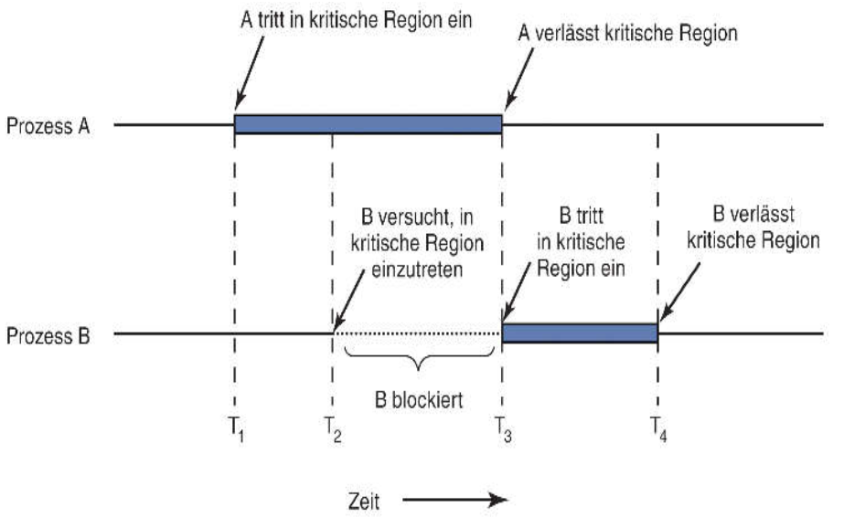

# Prozesse

Prozesse sind das zentrale Konzept in jedem Betriebssystem.

- Prozess = Programm in Ausführung
- modellieren Nebenläufigkeit
  - (Quasi-)Parallelität
  - Multiprogrammierung

## Prozessmodell

> Das Betriebssystem ist als Menge von (sequentiellen) Prozessen organisiert!

Jeder Prozess umfasst eine virtuelle CPU mit eigenem Adressraum

➡ Befehlszähler, Registerinhalte, Belegung von Variablen, ...

Da jeder Prozess einen eigenen Befehlszähler hat, dürfen keine Annahmen über den Zeitablauf getroffen werden.

### Unterschied Programm und Prozess

| Programm                     | Prozess               |
| ---------------------------- | --------------------- |
| Rezept mit allen Anweisungen | Aktivität des Backens |

Wird ein Programm 2x gestartet, ergibt das 2 Prozesse

## Prozesserzeugung

- Durch das Betriebssystem:
  - Initialisierung (als Hintergrundprozess)
  - Durch einen anderen Prozess (Systemaufruf)

Bsp.: Linux starten:


## Beziehungen zwischen Prozessen

Eltern-Kind-Beziehung

➡ Prozess-Familien bzw. Prozess-Hierarchien

- UNIX
  - Signale werden an alle Mitglieder der Familie verschickt
  - Prozesse entscheiden selbst, wie auf Signal reagiert werden soll
- Windows
  - Kein Konzept der Prozesshierarchie
  - alle Prozesse sind gleichwertig
    - Beziehungen werden durch Tokens (Handle) gesteuert
    - Enterbung durch Weitergabe von Handles möglich

## Prozessbeendigung

- Normales Beenden (freiwillig)
  - Wenn Aufgabe erledigt ist (exit / exitProcess)
- Beenden aufgrund eines Fehlers (freiwillig)
  - Prozess stellt einen Fehler fest, der nicht vom Programm verursacht wurde (bspw. Datendatei nicht vorhanden)
- Beenden aufgrund eines schwerwiegenden Fehlers (unfreiwillig)
  - Prozess selbst verursacht einen Fehler
  - Ausführen eines unzulässigen Befehls
  - Zugriff auf ungültige Speicheradresse
- Beenden durch anderen Prozess (unfreiwillig)
  - (kill / TerminateProcess)

## Prozess-Zustandsmodell


Übergänge werden vom Betriebssystem (Scheduler) verwaltet

## Scheduler

... verwaltet die Prozesse und ist die unterste Schicht des Betriebssystems

### Aufgaben

- Unterbrechungen (Interrupts) behandeln
- Starten und Stoppen von Prozessen
- Warteschlange für Prozesse

### Warteschlangenmodell


## Modell für Prozessverwaltung

Prozesstabelle:

- Ein Eintrag pro Prozess (Prozesskontrollblock (PCB))
- PCB beinhaltet alle Prozessinformationen
  - Prozessverwaltung:
    - Register, Befehlszähler, Stack, Program status word (PSW)
    - Prozessidentifikation (PID, Eltern-PID, UserID)
    - Zustandsinformationen (Priorität, verbrauchte CPU-Zeit, Signale, ...)
  - Speicherverwaltung
    - Pointer auf Textsegment
    - Pointer auf Datensegment
    - Pointer auf Stacksegment
  - Dateiverwaltung
    - Wurzelverzeichnis
    - Arbeitsverzeichnis
    - Offene Dateien
    - Benutzer-ID
    - Gruppen-ID

## Prozesswechsel (Bsp. E/A)

1. Sichern des Befehlszählers, Prozessorstatus, ...
   - Prozess auf "Blocked" setzen
2. Ursache der Unterbrechung ermitteln
3. Ereignis (z.B. Ende der E/A) entsprechend behandeln
   - Blockierte Threads auf "Ready" setzen
4. Sprung zum Scheduler
   - Entscheidet, welcher Prozess als nächstes läuft

Durch Multiprogrammierung erreichen wir eine verbesserte CPU-Auslastung. Wenn auf E/A gewartet wird, kann ein anderer Prozess in dieser Zeit auf die CPU.

# Threads

Bisher:

- Jeder Prozess hat einen _eigenen Adressraum_
- nur _einen Ausführungsfaden_
- Dadurch kein Zugriff auf den gleichen Zugriff möglich.

Lösung: Threads

- Erweitertes Prozessmodell
  - mehrere Ausführungsfäden mit _gleichem Addressraum_
  - Ausführung im Benutzermodus möglich
  - Erstellung ist 10-100 mal schneller als Prozesse
- Ressourcen-Bündelung
  - Adressraum, geöffnete Dateien, Signale, Kindprozesse, ...
- Ausführung von Prozessen
  - Befehlszähler, Register, Stack, ...
  - Mehrere Threads sind in einem Prozess möglich


## Thread-Verwaltung

Threads werden in einer Thread-Tabelle verwaltet. Dazu gehören:

- Thread-ID
- Befehlszähler, Register, Stack, Zustand

Jeder Thread hat einen eigenen Stack, aber gemeinsamen Adressraum.

### Lebenszyklus eines Threads

1. Erzeugung
   - Prozess erzeugt Thread (create)
   - Thread läuft im Adressraum des erzeugenden Prozesses
2. Beendigung
   - Nach Beendigung der Aufgabe oder Fehler (exit)
3. Synchronisation
   - Threads können aufeinander warten (join)
4. Freiwilliger Verzicht
   - Thread gibt CPU frei (yield)

Der Thread-Scheduler kann im Kernel oder im Benutzermodus laufen:


|        | Benutzermodus                                            | Kernmodus                                           |
| ------ | -------------------------------------------------------- | --------------------------------------------------- |
| Pro    | schneller Wechsel                                        | Kein Laufzeitproblem                                |
|        | Angepasster Scheduler                                    | Effizienter Umgang mit blockierenden Systemaufrufen |
|        |                                                          |                                                     |
| Contra | Umgang mit blockierenden Systemaufrufen                  | Höhere Kosten bei Threadwechsel                     |
|        | Ein Thread kann den gesamten Prozess blockieren          | Umngang mit Signalen                                |
|        | Threads sollen Programme ermöglichen, die oft blockieren |                                                     |

💡 Threads werden meist im Kernmodus realisiert!

## Threadwechsel

... erfolgt immer, wenn BS die Kontrolle erhält:

- Systemaufrufen
- Interrupts
- Ausnahmebehandlungen

Scheduler des BS entscheidet, welcher Thread als nächstes läuft.

# Vergleich Prozesse und Threads

- Prozess ist eine Einheit der Ressourcenverwaltung, Schutzeinheit
  - Adressraum, geöffnete Dateien, Signale, Prioritäten, ...
- Thread ist eine Einheit der Prozessorzuteilung
  - Befehlszähler, Register, Stack, Zustand, ...

➡ mehrere Threads pro Prozess möglich

# Interprozess-Kommunikation

Prozesse nutzen gemeinsame Ressourcen, haben aber getrennte Adressräume.

- unbewusst (Wettstreit)
- bewusst (Kooperation)
- Prozesse können sich kennen (Kommunikation)

Daher ist eine strukturierte Kommunikation notwendig.

## Problemkreise

- Informationen von einem Prozess an anderen weiterleiten (strukturiert)
- Vermeiden des gleichzeitigen Zugriffs auf gemeinsame Ressourcen
- Ablauf von Prozessen organisieren, wenn Abhängigkeiten vorliegen

## Race Conditions (Wettstreit)

- Prozesse nutzen gemeinsamen Speicher (Festplatte, Arbeitsspeicher, Drucker, etc.)
- Endergebnis hängt vom Ablauf ab
- Unbedingt vermeiden!

### Wie zu vermeiden?

- Zu einem Zeitpunkt darf nur jeweils einem Prozess der Zugriff erlaubt werden
- Synchronisation notwendig!
  - Sperrsynchronisation (Ausführung in beliebiger Reihenfolge)
  - Reihenfolgesynchronisation (in fester Reihenfolge)

# Wechselseitiger Ausschluss

- Kritische Regionen/Abschnitte
- Teile des Programmes, der Zugriff auf gemeinsam genutzte Ressourcen (kritische Ressourcen) enthält

## Bedingungen für wechselseitigen Ausschluss

1. Keine zwei Prozesse sind gleichzeitig in kritischen Regionen
2. Keine Annahmen über Geschwindigkeit und Anzahl der CPU
3. Kein Prozess, der außerhalb der kritischen Regionen läuft, darf andere Prozesse blockieren
4. Kein Prozess soll ewig warten, um in seine kritische Region einzutreten



## Mögliche Verfahren für wechselseitigen Ausschluss

### Ansatz 1: Interrupts ausschalten

- Prozesswechsel erfolgen durch Interrupt
- Probleme:
  - Funktioniert nur bei Ein-Prozessor-Rechnern
  - E/A ist blockiert
  - Ein Prozess im Benutzerraum übernimmt Kontrolle über BS
    - was passiert, wenn Interrupts nicht mehr eingeschaltet werden?

### Ansatz 2: Sperrvariablen

- Variable belegt zeigt an, ob kritischer Abschnitt belegt ist

```c
// Prozess 1
{
  while(belegt);    //begin_region()
  belegt = true;    //begin_region()
  // kritischer abschnitt
  belegt = false;   //end_region()
}

// Prozess 2
{
  while(belegt);    //begin_region()
  belegt = true;    //begin_region()
  // kritischer abschnitt
  belegt = false;   //end_region()
}
```

- Problem: Verhindert race condition nicht sicher
  1. Prozesse führen begin_region() gleichzeitig aus
  2. belegt wird von beiden Prozessen auf true gesetzt
  3. Beide Prozesse betreten kritischen Abschnitt

### Ansatz 3: Strikter Wechsel

- Variable `turn` gibt an wer an der Reihe ist

```c
// Prozess 0
{
  while(turn != 0);    //begin_region()
  // kritischer abschnitt
  turn = 2;            //end_region()
}

// Prozess 1
{
  while(turn != 1);    //begin_region()
  // kritischer abschnitt
  turn = 1;            //end_region()
}
```

- Problem: Verletzt die Anforderungen 3 und 4 der Bedingungen für wechselseitigen Ausschluss
  - ➡ Prozesse müssen abwechselnd in kritischen Abschnitt eintreten

### Ansatz 4: Lösung von Peterson

- Verbindung von Abwechseln und Sperrvariable

```c
// Prozess 0
{
  interested[0] = true;                 //begin_region()
  turn = 1;                             //begin_region()
  while(interested[1] && (turn == 1));    //begin_region()
  // kritischer abschnitt
  interested[0] = false;                //end_region()
}

// Prozess 1
{
  interested[1] = true;                 //begin_region()
  turn = 0;                             //begin_region()
  while(interested[0] && turn == 0);    //begin_region()
  // kritischer abschnitt
  interested[1] = false;                //end_region()
}
```

- Dies verhindert eine Verklemmung und race condition
- Jeder Prozess bekommt die Chance den kritischen Abschnitt zu betreten

**Frage: funktioniert die Lösung auch bei Mehrprozessorsystemen?**

- Problem:
  - Abfragen und Ändern einer Variablen sind zwei Schritte
- Lösung:
  - Atomare ReadModifiyWrite Operation der CPU
    - TSL = TestSetLock
    - Bei der Ausführung wird der Speicherbus gesperrt

**➡ Ja, aber Hardwareunterstützung ist notwendig!**

Effizienz:

- Busy-Waiting ➡ Prozessor wird blockiert
- Prozess belegt CPU während des Wartens
- Überrauschungseffekt bei unterschiedlichen Prioritäten
  - Prozess mit niedrigerer Priorität kann Prozess mit höherer Priorität blockieren
- ABER: Busy-Wait kann dennoch notwendig sein!

## Erzeuger-Verbraucher-Problem

Verallgemeinert:

- Erzeuger legen Dinge in Puffer
- Verbraucher nehmen Dinge aus Puffer

Es ist eine Synchronisation zwischen Erzeuger und Verbraucher notwendig:

- Erzeuger wartet, wenn Puffer voll ist
- Verbraucher wartet, wenn Puffer leer ist

Vermeidung von "busy wait" durch blockierende Systemaufrufe:

- sleep() -> Veranlasst den Aufrufer zu blockieren
- wakeup(pid) -> hebt die Blockierung von Prozess pid auf

- Erzeuger:
  - wird blockiert, falls Puffer voll ist (geht schlafen)
  - wird vom Verbraucher geweckt, wenn Puffer leer
- Verbraucher:
  - Wird blockiert, wenn der Puffer leer ist
  - Wird vom Erzeuger geweckt, wenn der Puffer voll ist

### Race Condition

Beispiel Erzeuger-Verbraucher:

```c
Producer ()
{
	while(TRUE) {
		Item = produce_item();
		if (count == N)
			sleep();
		insert_item(Item); // kritische Stelle
		count++;           // kritische Stelle
		if (count == 1)
			wakeup(consumer);
	}
}

Consumer()
{
	while(TRUE) {
		if (count == 0)
			sleep();
		Item = remove_item(Item); // kritische Stelle
		count--                   // kritische Stelle
		if (count == N-1)
			wakeup(producer);
		consume(Item);
	}
}
```

1. Puffer ist leer (`count = 0`) und Verbraucher analysiert `count`
2. der Scheduler wechselt und der Erzeuger schreibt was in den Puffer und erkennt, dass das count nun 1 ist und weckt den Consumer
3. Der Consumer läuft weiter und wird beim nächsten Aufruf schlafen gehen
   -> Ein Weckruf geht verloren

# Semaphoren

... sind allgemeine Synchronisationskonstrukte für wechselseitigen Ausschluss und für Reihenfolgensynchronisation

- Ganzzahlige Variable
  - **0 ->kein Weckruf**
  - **>0 -> ein oder mehrere Weckrufe**

Bedeutung des Zählers:

- Zähler >= 0:
  - Anzahl freier Ressourcen
  - bspw. Flaschen im Automat
- Zähler < 0:
  - Anzahl der wartenden Prozesse
  - bspw. durstige Studierende

2 **atomare** Funktionen notwendig:

- `down()`
  - Verallgemeinerung von `sleep()`

```c
if (Semaphor > 0) Semaphor --;
else if (Semaphor == 0) block(this_process);
```

- `up()`
  - Verallgemeinerung von `wakeup()`

```c
Semaphor++;
if (Semaphor <= 0) up(blocked_process);
```

## Implementierung

```c
Struct Semaphor {
	int count;
	Queue queue;
}

void down(Semaphor &s) {
	s.count--;
	if (s.count < 0) {
		// Prozess in s.queue ablegen;
		// Prozess blockieren;
	}
}

void up(Semaphor &s) {
	s.count++;
	if (s.count <= 0) {
		// Prozes aus s.queue holen;
		// Prozess auf READY setzen;
	}
}
```

- Es sind nur diese beiden Operationen erlaubt.
- Operationen _müssen_ atomar sein

## Mutex

... ist Anwendung von Semaphoren auf wechselseitigen Ausschluss

Mutex markiert einen kritischen Abschnitt/ Ressource/ ...

Mutex.Zähler = 1
->Binäres Semaphor

```c
// Prozess 1
{
  down(mutex);    //begin_region()
  // kritischer abschnitt
  up(mutex);   //end_region()
}

// Prozess 2
{
  down(mutex);    //begin_region()
  // kritischer abschnitt
  up(mutex);   //end_region()
}
```

## Anwendung auf Erzeuger-Verbraucher-Problem

Anforderungen:

1. Nur ein Prozess darf auf den Puffer zugreifen
2. Aus dem leeren Puffer darf nichts entfernt werden
3. In den vollen Puffer darf nichts eingefügt werden

Lösung:

1. Wechselseitiger Ausschluss (Mutex)
2. Semaphore full
   - wird mit 0 initialisiert
3. Semaphore empty
   - Wird mit **N=Puffergröße** initialisiert

Dadurch haben wir wechselseitigen Ausschluss und eine Reihenfolgesynchronisation

```c
Semaphor mutex = 1; // wechselseitiger Ausschluss
Semaphor full = 0;  // verhindert Entfernen aus leerem Puffer
Semaphor empty = N; // verhindert Schreiben in vollen Puffer

void producer() {
	while (TRUE) {
		item = produce_item();
		down(&empty);
		down(&mutex);
		insert_item(item);
		up(&mutex);
		up(&full);
	}
}

void consumer() {
	while (TRUE) {
		down(&full);
		down(&mutex);
		item = remove_item();
		up(&mutex);
		up(&empty);
	}
}
```

➡ **Daumemregel: Eine Semaphore für jede Randbedingung (Constraint)**

💡Reihenfolge ist wichtig!

# Monitor

- Programmierung von Semaphoren ist schwierig
  - Reihenfolge der up/down-Operationen wichtig
  - Synchronisation über das gesamte Programm verteilt

Mögliche Lösung: Monitore

- Sammlung von Prozeduren, Variablen, Datenstrukturen
- Zugriff auf Daten nur über Monitor-Prozeduren
- Alle Prozeduren stehen unter wechselseitigem Ausschluss
  - nur jeweils ein Prozess kann den Monitor benutzen
  - nur eine Prozedur des Monitor kann ausgeführt werden
- Realisierung über Compiler

💡In Java: "`sychronized`" garantiert, dass nur eine Methode des Objekts ausgeführt wird.

## Realisierung

- Mutex für wechselseitigen Ausschluss
- Für Reihenfolgensynchronisation:
  - Zustandsvariable
  - Zwei Operationen:
    - `wait()`: Blockieren des aufrufenden Prozesses
    - `signal()`: Aufwecken blockierter Prozesse

![[monitor_realisierung.png]]

## Eigenschaften von Monitoren

- Es kann immer nur ein Prozess im Monitor aktiv sein!
- Zentrale Idee: Prozess kann auch innerhalb der kritischen Region schlafen gehen, da der Lock mit dem schlafen gehen freigegeben wird
  - Unterschied zu Semaphore: kann nicht in krit. Reg. warten
- Monitor-Realisierung braucht:
  - Mutex
  - Zustandsvariablen

### Vorteile und Nachteile von Monitoren

| Pro                                   | Contra                                                                                          |
| ------------------------------------- | ----------------------------------------------------------------------------------------------- |
| Weniger Fehleranfällig als Semaphoren | Da Monitore ein Pattern sind, muss der Kompiler damit umgehen können. C alleine kann das nicht. |
|                                       | Monitore eignen sich nicht für verteilte Systeme                                                |

➡ Austausch von Nachrichten in Verteilten Systemen

# Nachrichtenaustausch

(message passing)

## Motivation:

- Bisher: speicherbasierte Kommunikation
  - über gemeinsamen Speicher
  - Synchronisation muss explizit programmiert werden
- Nachrichtenbasierte Kommunikation:
  - Senden/Empfangen von Nachrichten (über das BS)
  - über Rechnergrenzen hinweg möglich
  - implizite Synchronisation

## Primitive

1. `send(Ziel, Nachricht)`
   - Versenden einer Nachricht (ähnlich wie `up()`)
2. `receive(Quelle, Nachricht)`
   - Empfang einer Nachricht (ähnlich wie `down()`) -> Blockieren, bis Nachricht vorhanden

### Besonderheiten

- Nachrichten werden bestätigt (Ack) -> Verlust von Nachrichten absichern
- Authentifizierung in verteilten Systemen
- Lokal ist Nachrichtenaustausch immer langsamer als Semaphoren

# Deadlocks/Verklemmungen

Next:
[Scheduling und Deadlocks](03-SchedulingDeadlocks.md)
