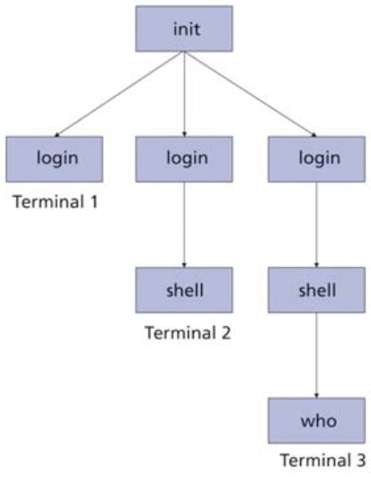
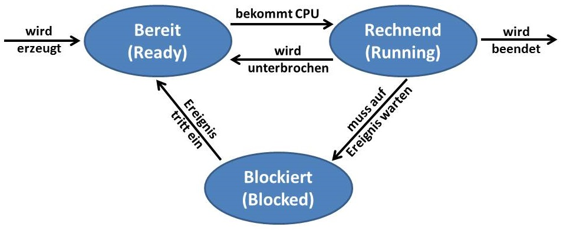
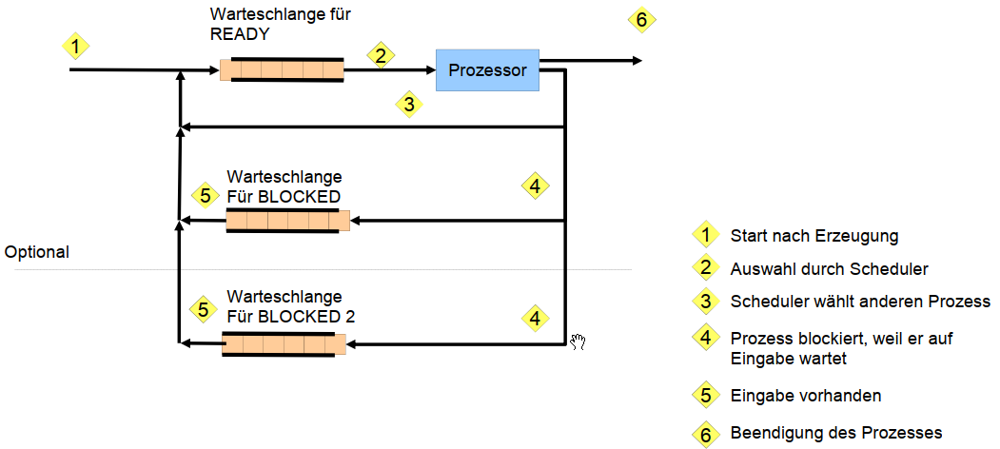
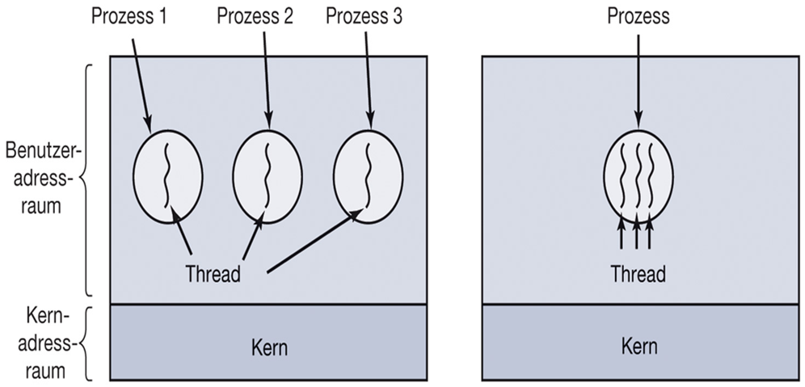
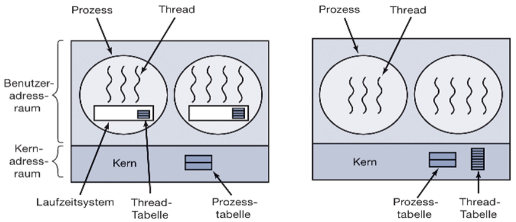

# Prozesse

Prozesse sind das zentrale Konzept in jedem Betriebssystem.

- Prozess = Programm in Ausführung
- modellieren Nebenläufigkeit
  - (Quasi-)Parallelität
  - Multiprogrammierung

## Prozessmodell

> Das Betriebssystem ist als Menge von (sequentiellen) Prozessen organisiert!

Jeder Prozess umfasst eine virtuelle CPU mit eigenem Adressraum

:arrow_right: Befehlszähler, Registerinhalte, Belegung von Variablen, ...

Da jeder Prozess einen eigenen Befehlszähler hat, dürfen keine Annahmen über den Zeitablauf getroffen werden.

### Unterschied Programm und Prozess

| Programm                     | Prozess               |
| ---------------------------- | --------------------- |
| Rezept mit allen Anweisungen | Aktivität des Backens |

Wird ein Programm 2x gestartet, ergibt das 2 Prozesse

## Prozesserzeugung

- Durch das Betriebssystem:
  - Initialisierung (als Hintergrundprozess)
  - Durch einen anderen Prozess (Systemaufruf)

Bsp.: Linux starten:

## Beziehungen zwischen Prozessen

Eltern-Kind-Beziehung

:arrow_right: Prozess-Familien bzw. Prozess-Hierarchien

- UNIX
  - Signale werden an alle Mitglieder der Familie verschickt
  - Prozesse entscheiden selbst, wie auf Signal reagiert werden soll
- Windows
  - Kein Konzept der Prozesshierarchie
  - alle Prozesse sind gleichwertig
    - Beziehungen werden durch Tokens (Handle) gesteuert
    - Enterbung durch Weitergabe von Handles möglich

## Prozessbeendigung

- Normales Beenden (freiwillig)
  - Wenn Aufgabe erledigt ist (exit / exitProcess)
- Beenden aufgrund eines Fehlers (freiwillig)
  - Prozess stellt einen Fehler fest, der nicht vom Programm verursacht wurde (bspw. Datendatei nicht vorhanden)
- Beenden aufgrund eines schwerwiegenden Fehlers (unfreiwillig)
  - Prozess selbst verursacht einen Fehler
  - Ausführen eines unzulässigen Befehls
  - Zugriff auf ungültige Speicheradresse
- Beenden durch anderen Prozess (unfreiwillig)
  - (kill / TerminateProcess)

## Prozess-Zustandsmodell

Übergänge werden vom Betriebssystem (Scheduler) verwaltet

## Scheduler

... verwaltet die Prozesse und ist die unterste Schicht des Betriebssystems

### Aufgaben

- Unterbrechungen (Interrupts) behandeln
- Starten und Stoppen von Prozessen
- Warteschlange für Prozesse

### Warteschlangenmodell

## Modell für Prozessverwaltung

Prozesstabelle:

- Ein Eintrag pro Prozess (Prozesskontrollblock (PCB))
- PCB beinhaltet alle Prozessinformationen
  - Prozessverwaltung:
    - Register, Befehlszähler, Stack, Program status word (PSW)
    - Prozessidentifikation (PID, Eltern-PID, UserID)
    - Zustandsinformationen (Priorität, verbrauchte CPU-Zeit, Signale, ...)
  - Speicherverwaltung
    - Pointer auf Textsegment
    - Pointer auf Datensegment
    - Pointer auf Stacksegment
  - Dateiverwaltung
    - Wurzelverzeichnis
    - Arbeitsverzeichnis
    - Offene Dateien
    - Benutzer-ID
    - Gruppen-ID

## Prozesswechsel (Bsp. E/A)

1. Sichern des Befehlszählers, Prozessorstatus, ...
   - Prozess auf "Blocked" setzen
2. Ursache der Unterbrechung ermitteln
3. Ereignis (z.B. Ende der E/A) entsprechend behandeln
   - Blockierte Threads auf "Ready" setzen
4. Sprung zum Scheduler
   - Entscheidet, welcher Prozess als nächstes läuft

Durch Multiprogrammierung erreichen wir eine verbesserte CPU-Auslastung. Wenn auf E/A gewartet wird, kann ein anderer Prozess in dieser Zeit auf die CPU.

# Threads

Bisher:

- Jeder Prozess hat einen _eigenen Adressraum_
- nur _einen Ausführungsfaden_
- Dadurch kein Zugriff auf den gleichen Zugriff möglich.

Lösung: Threads

- Erweitertes Prozessmodell
  - mehrere Ausführungsfäden mit _gleichem Addressraum_
  - Ausführung im Benutzermodus möglich
  - Erstellung ist 10-100 mal schneller als Prozesse
- Ressourcen-Bündelung
  - Adressraum, geöffnete Dateien, Signale, Kindprozesse, ...
- Ausführung von Prozessen
  - Befehlszähler, Register, Stack, ...
  - Mehrere Threads sind in einem Prozess möglich

## Thread-Verwaltung

Threads werden in einer Thread-Tabelle verwaltet. Dazu gehören:

- Thread-ID
- Befehlszähler, Register, Stack, Zustand

Jeder Thread hat einen eigenen Stack, aber gemeinsamen Adressraum.

### Lebenszyklus eines Threads

1. Erzeugung
   - Prozess erzeugt Thread (create)
   - Thread läuft im Adressraum des erzeugenden Prozesses
2. Beendigung
   - Nach Beendigung der Aufgabe oder Fehler (exit)
3. Synchronisation
   - Threads können aufeinander warten (join)
4. Freiwilliger Verzicht
   - Thread gibt CPU frei (yield)

Der Thread-Scheduler kann im Kernel oder im Benutzermodus laufen:

|        | Benutzermodus                                            | Kernmodus                                           |
| ------ | -------------------------------------------------------- | --------------------------------------------------- |
| Pro    | schneller Wechsel                                        | Kein Laufzeitproblem                                |
|        | Angepasster Scheduler                                    | Effizienter Umgang mit blockierenden Systemaufrufen |
|        |                                                          |                                                     |
| Contra | Umgang mit blockierenden Systemaufrufen                  | Höhere Kosten bei Threadwechsel                     |
|        | Ein Thread kann den gesamten Prozess blockieren          | Umngang mit Signalen                                |
|        | Threads sollen Programme ermöglichen, die oft blockieren | |

# Interprozess-Kommunikation

# Deadlocks/Verklemmungen
