# Scheduling

- Mehrere Prozesse konkurrieren um die CPU
- Betriebssystem muss entscheiden, welcher Prozess/Thread als nächstes laufen soll
- **Scheduler** trifft diese Entscheidung (aufgrund von Scheduling-Strategie; scheduling algorithm)
- CPU wird verwaltet

**Batch-System vs. Interaktives System**
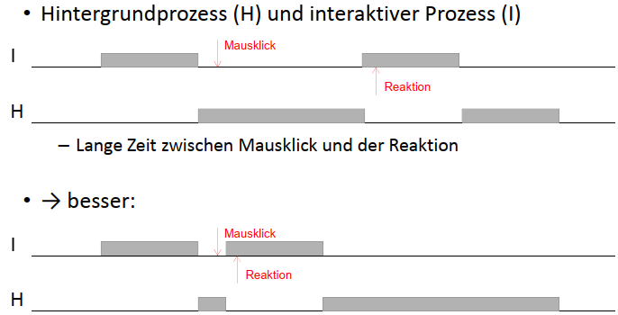

## Kriterien:

### Betriebsart

- Stapelverarbeitungssystem (Batch-System)
  - Viele nicht interaktive Aufträge
  - Einsatz im Großrechner
- Interaktiver Betrieb
  - Typische Arbeitsrechner
  - Server
- Echtzeitsysteme
  - Steueraufgaben
  - Multimedia-Anwendungen

### Prozess-Charakteristik

- CPU-lastiger Prozess, rechenintensiv
  
- E/A-lastiger Prozess, datenintensiv
  

- CPU-Performance nimmt schneller zu als Plattenperformance
- Programme werden immer mehr E/A-lastig

## Zeitpunkt des Schedulings

- Bei der Erzeugung eines Prozesses (Eltern oder Kind)
- Beendigung eines Prozesses
  - entweder Prozess aus Menge READY
  - oder, falls READY = Ø, BS
- rechnende Prozess wird blockiert
  - E/A, Semaphor, ...
  - Grund kann Auswirkung auf Scheduling haben
- E/A-Interrupt
- Zyklische Interrupts/ Timerinterrupts

## Bewertung von Scheduling-Strategien

### Kriterien (Benutzersicht)

- Minimierung der Durchlaufzeit (Stapelbetrieb)
- Minimierung der Antwortzeit (interaktive Systeme)
- Einhalten von Terminen (Realzeitbetrieb)
- Vorhersehbarkeit

### Kriterien (Systemsicht)

- Maximierung des Durchsatzes (Stapelbetrieb)
- Optimierung der Prozessorauslastung (Stapelbetrieb)
- Balance (gleichmäßiges Auslasten aller Ressourcen)
- Fairness (Vergleichbare Prozesse sollen gleich behandelt werden)
- Durchsetzung von Prioritäten

## Scheduling-Strategien

- **Nicht-unterbrechend** (nonpreemptive)
  - ausgewählter Prozess läuft, bis er selbst freigibt oder blockiert
  - Einsatz in Stapelverarbeitungs- oder Echtzeitsystemen
- **Unterbrechend** (preemptive)
  - aktivem Prozess kann die CPU entzogen werden
    - Timer-Interrupt
    - Prozess mit höherer Prio
  - Einsatz in interaktiven und Echtzeitsystemen

### First Come First Served (FCFS)

- einfachste Strategie
- an längsten wartender Prozess in READY darf als nächstes auf die CPU
  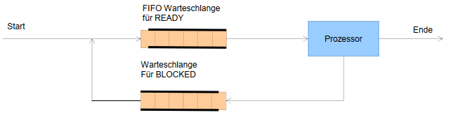

### Shortest Job First (SJF)

- der am kürzesten rechnende Prozess in READY darf als nächstes auf die CPU
- Voraussetzung: Laufzeit ist vorher bekannt
  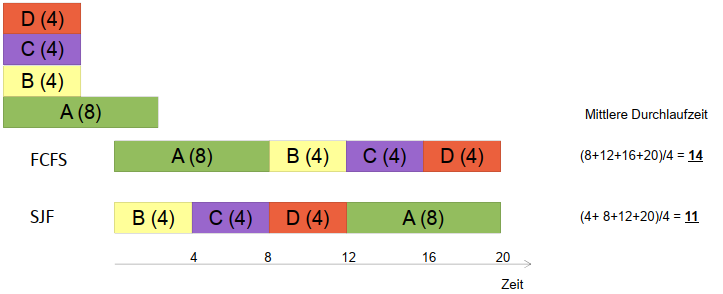

### Shortest Remaining Time First (SRTF)

- Prozess aus READY mit der kürzesten verbleibenden Zeit darf als nächstes auf die CPU
- <u>Unterbrechende</u> Variante von Shortest Job First
- Laufzeit muss im Voraus bekannt sein
  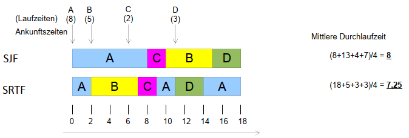

### Round-Robin (RR) / Zeitscheibenverfahren

- Einfachste Strategie für interaktive Systeme
- <u>Unterbrechende</u> Variante von First Come First Serve
- Jeder laufende Prozess - wird nach einem Quantum unterbrochen und abgelöst - oder wird davor blockiert - oder beendet sich selbst
  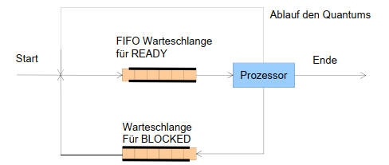

#### Länge des Quantum

- Kurzes Quantum:
  - kurze Antwortzeiten
  - Schlechte CPU-Nutzung (häufiger Prozesswechsel)
- Langes Quantum:
  - Lange Antwortzeiten
  - Bessere CPU-Nutzung (weniger Prozesswechsel)
- Praxiswert: 20-50 ms

**RR ist nicht fair** ➡E/A-lastige Prozesse werden benachteiligt

### Prioritätsbasiertes Scheduling

- Zusammenfassung in Prioritätsklassen
- Prioritäten-Scheduling zwischen den Klassen
  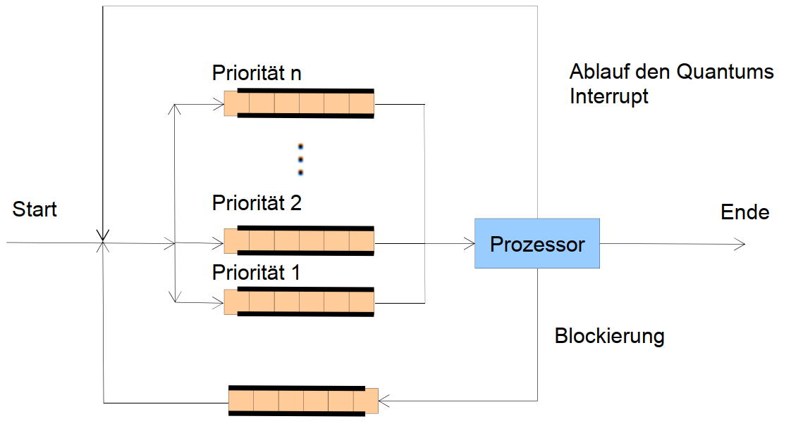

Bsp.:

- Mehrere Betriebsarten im System
- aber: unterschiedliche Scheduling-Strategien innerhalb der Warteschlangen

| Priorität | Prozessklasse                 | Scheduling-Stategie |
| --------- | ----------------------------- | ------------------- |
| 1         | Echtzeitprozesse (Multimedia) | Prioritäten         |
| 2         | Interaktive Prozesse          | RR                  |
| 3         | E/A-Prozesse                  | RR                  |
| 4         | Rechenintensive Prozesse      | FCFS                |

## Scheduling in Echtzeitsystemen

- Zeit spielt entscheidende Rolle
  - Harte Echtzeitsysteme: Absolute Deadlines, die strikt eingehalten werden müssen
  - Weiche Echtzeitsysteme: Die Verletzung einer Deadline ist unerwünscht aber tolerierbar
- Verhalten (Laufzeit $C_i$) der Prozesse ist bekannt
- Ereignisse treten periodisch oder aperiodisch auf
- statische und dynamische Scheduling-Strategien werden verwendet

## Thread-Scheduling

### Im Benutzer-Modus

- Kosten für Wechsel sind geringer
- Scheduler des Laufzeitsystems läuft im Benutzermodus

### Im Kern-Modus

- Das Umschalten zwischen Threads kann das Umschalten zwischen Prozessen bedeuten

# Deadlocks / Verklemmungen

Eine Ressource kann (oft) nur jeweils von einem Prozess genutzt werden.
Diese Ressourcen kann man in verschiedene Kategorien einteilen:

- Unterbrechbar (preemptable)
  - CPU
  - Hauptspeicher
  - ➡Deadlock kann verhindert werden
- Ununterbrechbar (nonpreemptable)
  - CD-Brenner
  - ➡**Deadlocks haben immer mit nicht-unterbrechbaren Ressourcen zu tun**

**Verhungern vs Verklemmung**

- Verhungern:
  - Prozess wartet unendlich lang
  - Kann enden
- Deadlock
  - Zyklisches Warten
  - Braucht externe Eingriffe

➡ Deadlock führt zum Verhungern

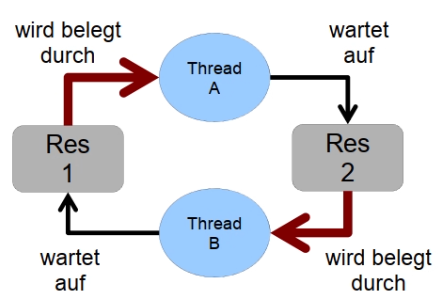

## Definition

> Eine Menge von Prozessen befindet sich in einem Deadlock, wenn jeder Prozess aus der Menge auf ein Ereignis wartet, das nur ein anderer Prozess aus dieser Menge auslösen kann

... sind _nicht-deterministisch_

- "Falsches Timing"
- falsches Design

### Bedingungen

- Wechselseitiger Ausschluss
- Hold-and-Wait-Bedingung
- Ununterbrechbarkeit
- Zyklisches Warten

Diese Bedingungen sind <u>zusammen</u> notwendig und hinreichend.
➡ Wenn eine der Bedingungen unerfüllbar ist, können keine Deadlocks auftreten

### Beispiele

ungünstiger Verlauf:
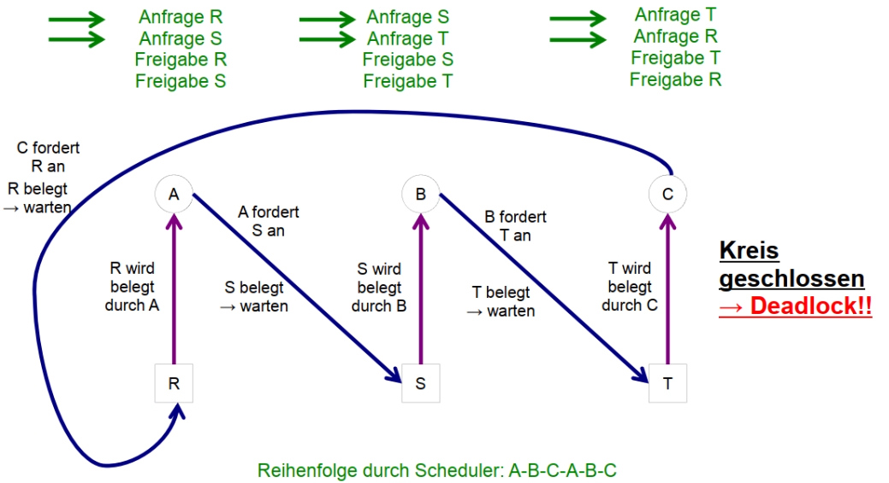

günstiger Verlauf:
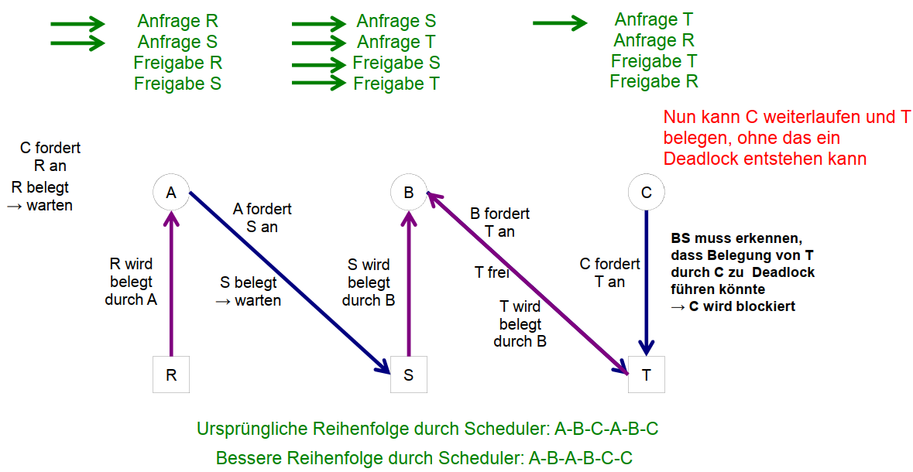

## Behandlung von Deadlocks

- Vogel-Strauß-Methode
  - Ignoranz (UNIX)
- Deadlock-Erkennung und Behebung
  - Lässt alle Anforderungen zu, um bei Bedarf Deadlock aufzulösen
  - Erkennen von Deadlocks notwendig
- Vermeidung/ Verhinderung
  - Lasse das System **nie** in eine Deadlock-Situation kommen
  - Verhindern von Deadlocks durch vorsichtige Ressourcen-Zuteilung
  - Vermeiden von Deadlock durch Unerfüllbarkeit einer der Deadlock-Bedingungen

### Erkennung

... mittels Ressourcen-Belegungs-Graph:
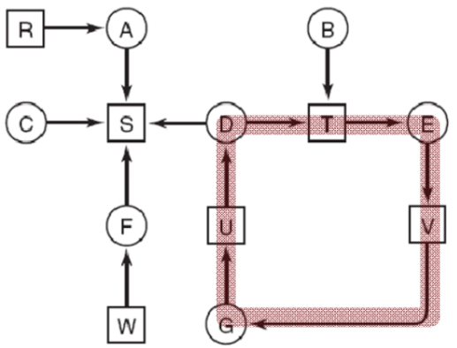
Zyklus ➡ Deadlock!
Algorithmus zum Erkennen der Zyklen notwendig!

#### Verallgemeinerung

- Mehrere Ressourcen pro Typ
- Prozess wartet nicht mehr auf eine bestimmte Ressource, sondern auf **irgendeine** Ressource des passenden Typs
- Ressourcen-Belegungs-Graph nicht mehr ausreichend ➡Matrix basierter Algorithmus

- Modellierung des Systems:
  - $n$ Prozesse $P_1, ..., P_n$
  - $m$ Klassen/Typen von Ressourcen
  - Klasse/Typ $i$ $(1 \le i \le m)$ enthält $E_i$ Ressource-Instanzen
    - _\*\*Ressourcen-Vektor $E$_\*\* gibt Anzahl verfügbarer Ressourcen für jede(n) Klasse/Typ an
  - Klasse/Typ $i$ $(1 \le i \le m)$ wurde $x_i$ mal belegt. Damit sind noch $A_i$ Instanzen der Klasse frei
    - _**Ressourcen-Vektor $A$**_ gibt Anzahl noch freier Ressourcen für jede(n) Klasse/Typ an
  - Klasse/Typ $j$ $(1 \le i \le m)$ wurde vom Prozess $i$ $(1 \le j \le n)$ $C_{ij}$ mal belegt
    - _**Belegungsmatrix $C$**_ gibt Anzahl der Ressourcen der Klasse $j$ , die durch den Prozess $P_i$ belegt sind, an
  - Klasse/Typ $j$ $(1 \le i \le m)$ wurde vom Prozess $i$ $(1 \le j \le n)$ $R_{ij}$ mal angefordert
    - _**Anforderungsmatrix $R$**_ gibt Anzahl der Ressourcen der Klasse $j$, die durch den Prozess $P_i$ angefordert sind, an

| $E = (E_1, E_2, E_3, ... , E_m)$                                                                                                                                                                                  | $A = (A_1, A_2, A_3, ... A_m)$                                                                                                                                                                                      |
| ----------------------------------------------------------------------------------------------------------------------------------------------------------------------------------------------------------------- | ------------------------------------------------------------------------------------------------------------------------------------------------------------------------------------------------------------------- |
| $C=\begin{bmatrix}C_{11} & C_{12} & C_{13} &  \dots & C_{1m}\\C_{21} & C_{22} & C_{23} &  \dots & C_{2m}\\\vdots & \vdots & \vdots &  \ddots & \vdots\\C_{n1} & C_{n2} & C_{n3} &  \dots & C_{nm}\\\end{bmatrix}$ | $C=\begin{bmatrix}R_{11} & R_{12} & R_{13} &  \dots & R_{1m}\\ R_{21} & R_{22} & R_{23} & \dots & R_{2m}\\\vdots & \vdots & \vdots &  \ddots & \vdots\\ R_{n1} & R_{n2} & R_{n3} &  \dots & R_{nm}\\ \end{bmatrix}$ |

Bsp. 1:
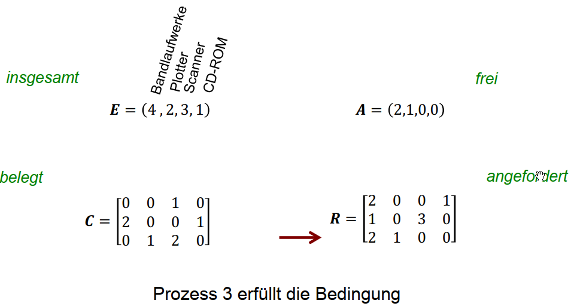
Bsp. 2:
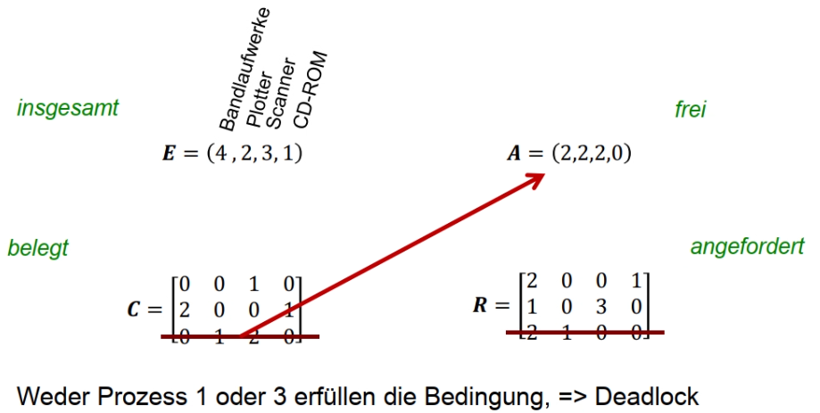

#### Einsatz

- Bei jeder Ressourcen-Anforderung
  - Sofortiges Erkennen von Deadlocks
  - Hoher Rechenaufwand
- Regelmäßig
- Bei niedriger CPU-Auslastung
  - CPU arbeitet nicht, obwohl Prozesse vorhanden sind
  - Rechenkapazität ist in dieser Situation ausreichend verfügbar
  - Deadlock werden bei ständiger Last der CPU nicht entdeckt

### Behebung

- Temporärer Entzug einer Ressource:
  - Schwierig bis unmöglich (oft nur manuell)
- Rücksetzen eines Prozesses
  - Voraussetzung: Checkpoints
  - Nachteil: Checkpoint Overhead
- Abbruch eines Prozesses
  - Brutalstmöglich!
  - Geht nur mit Prozessen, die problemlos neu gestartet werden können!

### Vermeidung/ Verhinderung

- Algorithmus notwendig, der immer die richtigen Scheduling-Entscheidungen trifft
- Voraussetzungen:
  - Welcher Prozess wird wann gestartet?
  - In welcher Reihenfolge werden die Ressourcen angefordert?
  - Wann werden Ressourcen wieder freigegeben?

#### Sichere und Unsichere Zustände

**Sicherer Zustand**: Garantie für Beendigung aller Prozesse möglich
**Unsicherer Zustand**: sonstige Zustände

💡Unsichere Zustände führen nicht zwangsläufig zu Deadlocks

Next:
[Speicherverwaltung](04-Speicherverwaltung.md)
