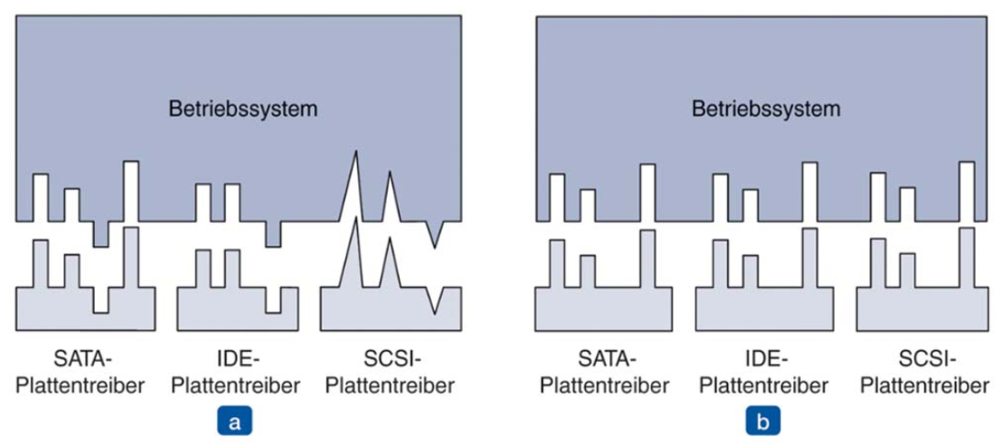
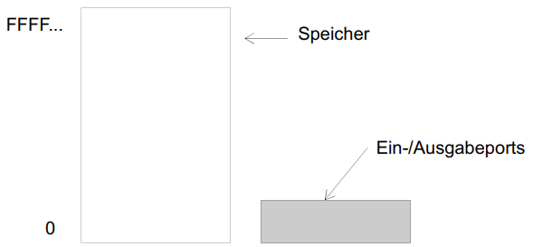
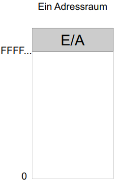
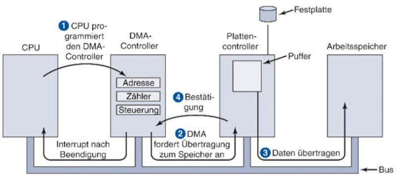
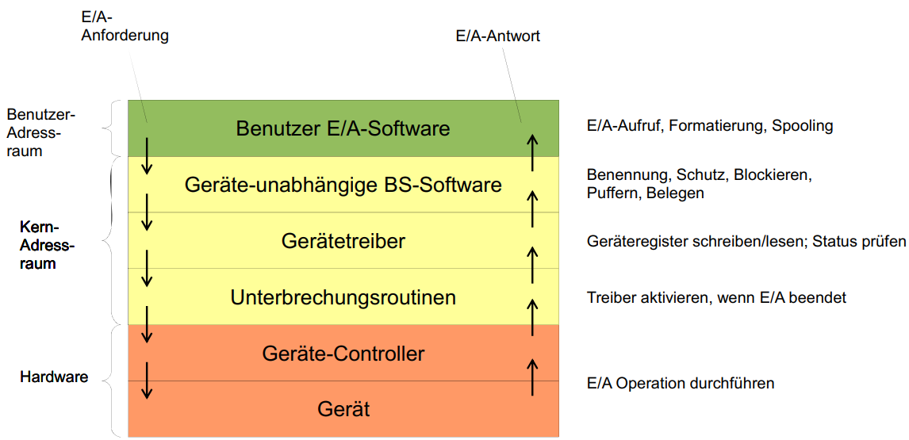

# Eingabe-/Ausgabe-Hardware

## Grundsätzliches

- BS steuert alle E/A-Geräte
  - Weiterleitung von Kommandos an die Geräte
  - Abfangen von Interrupts der Geräte
  - Behandlung von Fehlern
- E/A-Geräte sind auch Ressourcen

**Abstraktion als wesentlicher Teil des BS**

- Programmierbarkeit von E/A-Geräten vereinfachen
- Geräteunabhängigkeit gewährleisten

## Arten von E/A

### Blockorientierte Geräte (block devices)

- Informationen werden in Blöcken fester Größe gespeichert
- Jeder Block besitzt eine Adresse
- Jeder Block kann unabhängig von anderen Blöcken gelesen werden

Bsp.:

- Festplatte
- USB-Stick
- ...

### Zeichenorientierte Geräte (character devices)

- Zeichenströme werden erzeugt oder akzeptiert
- Geräte sind nicht adressierbar und bieten keine Suchfunktion

Bsp.:

- Tastatur
- Monitor
- Netzwerkkarte

## Ziel

- Einheitliches Ziel für Ein- & Ausgabe
- Einheitliche Schnittstelle (Datei / Treiber)

## Controller

- <u>Elektronischer</u> Teil des E/A-Geräts
- Spezielle Hardware, oft mit eigenem Mikroprozessor
  - Eigene Register für Kommunikation
  - evtl. Datenpuffer
- Steuert das Gerät weitgehend autonom
  - Kann Interrupts senden
- Bietet Schnittstellen an

## Kommunikation Controller-Betriebssystem

### E/A-Port-Nummern (I/O Port Nummer)

- jedes Kontrollregister erhält eine E/A-Port-Nummer
- nur BS kann zugreifen
- Unterschiedlicher Adressraum für Arbeitsspeicher und E/A-Geräte

### Speicherbasierte E/A (memory mapped I/O)

- Einbinden der Controller-Register in den Adressraum
  - Jedes Controller-Register erhält Speicheradresse, zu der kein Arbeitsspeicher vorhanden ist
  - Zugriff auf Geräte wie bei Speicherzugriff

| Vorteile                                                                                      | Nachteile                                                                                                                                    |
| --------------------------------------------------------------------------------------------- | -------------------------------------------------------------------------------------------------------------------------------------------- |
| Gleiche Routine wie beim Speicherzugriff (Weniger Assembler Code als bei Port-Nummern)        | Probleme mit Caching bei Registern (Unterstützung selektives Ausschalten von Caching nötig)                                                  |
| Kein spezieller Schutzmechanismus notwendig, der Benutzerprogramme vom Zugriff auf E/A abhält | Unterstützung von Mehr-BUS-Systemen (Jeder Speicherzugriff muss untersucht werden, um festzustellen, welches Gerät angesprochen werden soll) |
| Anzahl der Zugriffe auf Register kann reduziert werden                                        |                                                                                                                                              |

### Direct Memory Access (DMA)

- Bisher: CPU ist für das Holen von Daten verantwortlich
- DMA-Controller muss vorhanden sein
  - Regelt Datentransfer zu mehreren Geräten

#### Wortmodus

- DMA-Controller verlangt ein Wort und bekommt dieses geliefert
- will die CPU den Bus zu diesem Zeitpunkt auch verwenden, muss die CPU warten

#### Blockmodus

- Der DMA-Controller belegt den Bus und führt die gesamte Übertragung durch
- Dann wird der Bus wieder freigegeben
  - Burst-Modus: effizienter, aber der Bus kann lange blockiert sein

# Software zur E/A

## Anforderungen/ Ziele

- Geräteunabhängigkeit
- Einheitliches Benennungsschema
- Fehlerbehandlung
- Gleichheit unterbrechender (synchroner) und blockierender (asynchroner) Aufrufe
- Puffermöglichkeit
- Unterscheidung von gemeinsamen und exklusiv genutzter Geräte

## Ansätze zur Durchführung von E/A

### Programmierte E/A

- Auftrag wird an Controller geschickt und aktiv gewartet (busy-wait)
- Nachteil: Prozessor ist komplett belegt
  - aktives Warten (busy-wait)
  - Aber manchmal trotzdem günstig

### Interrupt-gesteuerte E/A

- Prozess beauftragt Controller und kehrt sofort zurück
- Wenn der Auftrag erledigt ist, sendet der Controller einen Interrupt
- Interrupt wird behandelt

➡ Sinnvoll bei langsamen E/A-Geräten

### DMA-basierte E/A

- DMA-Controller koordiniert die Datenübertragung
- Datenübertragung wird durch Controller gestartet
- Nach Beendigung wird ein Interrupt gesendet

Vorteile:

- Verringerung der Interrupts
- Entlastung der CPU
- Sinnvoll (nur) bei Übertragung größerer Datenblöcke

## Schichten-Architektur der E/A-Software

Next:
[Sicherheit](07-Sicherheit.md)
