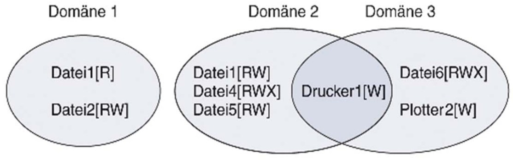
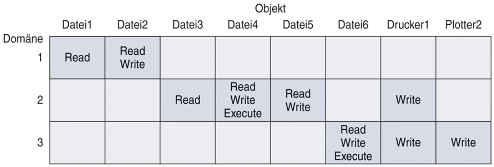
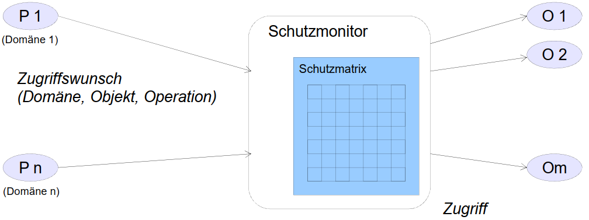
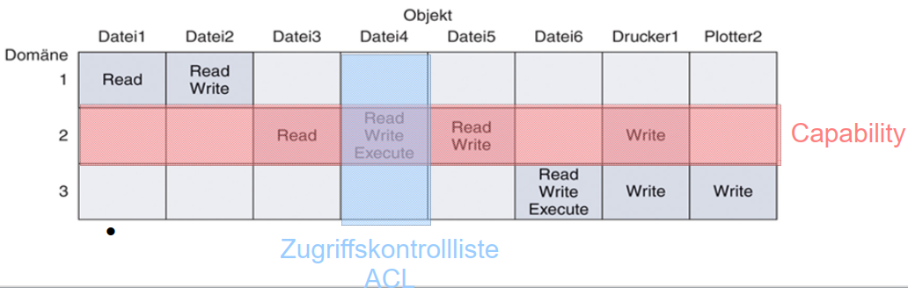
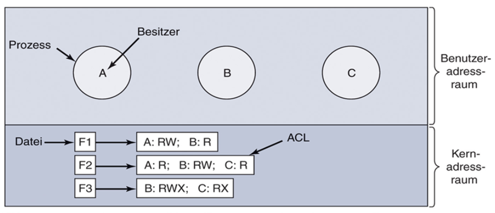
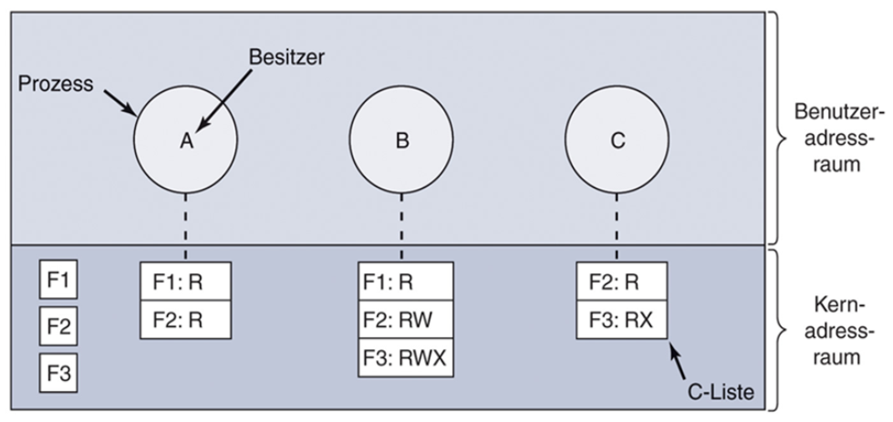

# Sicherheit

**Sicherheit ("security")**

- Nicht-Technische Herausforderung

**Schutz ("protection")**

- Technische oder organisatorische Maßnahme

💡hier muss das Betriebssystem ansetzen

## Bedrohung und Sicherheitsziele des Betriebssystems

| Bedrohung                   | Ziel                      |
| --------------------------- | ------------------------- |
| Enthüllung von Daten        | Vertraulichkeit von Daten |
| Manipulation von Daten      | Datenintegrität           |
| Dienstverweigerung (DoS)    | Systemverfügbarkeit       |
| Systemübernahme durch Viren | Ausschluss von Dritten    |

## Gefahren für Systeme

- unbeabsichtigter Datenverlust
  - Katastrophen
  - Hardware- & Softwarefehler
  - Menschliches Versagen
- Angreifer
  - Passive Angreifer (Interesse an Daten)
  - Aktive Angreifer (Interesse an Manipulation und Zerstörung)

## Schutzmechanismen

### Triple A - AAA

- **Authentifizierung**
  - _Wer macht was?_
  - Prüfung der Identität
- **Autorisierung**
  - _Wer darf was im System tun?_
  - Vergabe von Zugriffsrechten an Benutzer
- **Accounting**
  - _Wer hat was im System gemacht?_
  - Protokollierung von Aktivitäten

### Schutz-Domäne

- _Was ist zu schützen?_
  - Hardware
  - Software
- Schützenswerte Objekte
  - Eindeutige Namen
  - Endliche Menge von Operationen
- Recht
  - Erlaubnis eine Operation durchzuführen

➡<u>Domäne</u> ist Menge von (Objekt, Rechte)-Paaren

### Schutz-Matrix

## Realisierung der Zugriffskontrolle

- Zugriff nur über Zugriffsmonitor
  - Muss vertrauenswürdig sein
  - Muss privilegiert sein, den Zugriff durchzuführen

### Schutzmatrix

- ❗Schutzmatrix ist sehr groß, aber nur dünn besetzt
- ➡ Speichern in Listen
  - Nur die nicht leeren Elemente
  - 💡Spaltenweise -> Zugriffskontrolle (ACL)
  - 💡Zeilenweise -> Capabilities

### Zugriffskontrollliste (Access Control List; ACL)

- Spalte durch Zugriffsmatrix
- Jedem Objekt wird eine Liste zugeordnet, die beschreibt, welche Domänen wie zugreifen dürfen
- Liste wird gemeinsam mit dem Objekt gespeichert (Bei Datei: zugehöriger I-Node)
- Listenelemente: Paare (Domäne, Operationen)

### Capabilities

- Zeile der Schutzmatrix
- Jeder Domäne wird eine Liste zugeordnet, die die Objekte und Operationen enthält, auf die die Domäne zugreifen kann
- Listenelemente: Paare (Objekte, Operationen)
- Liste wird im BS gehalten

### Vergleich ACL vs. Capability

- Capabilities sind effizient
- Capabilities können Prozesse effizient kapseln

- ACL erlauben den selektiven Entzug von Rechten

:arrow_right: Realisierung durch Mischform

- ACL für Rechteverwaltung
- Prüfung aber nur beim Öffnen, danach wird ein Handle wie eine Capability verwendet

### POLA (Principle of Least Authority)

- Sicherheit funktioniert am Besten, wenn jede Domäne:
  - die minimalen Privilegien hat
  - die minimale Anzahl an Objekten hat
- die notwendig sind um die Aufgabe zu erfüllen

## Maßnahmen gegen Angriffe

### Insider Angriffe

- Der Code wird bei Erstellung des Systems eingebaut
- Falltüren, Login-Spoofing, ...
- Gegenmaßnahme: Code-Review

### Ausnützen von Programmfehlern

- Pufferüberläufe, Code-Injektion
- Gegenmaßnahmen: Programmierempfehlungen

### Injektion von Malware

- Der Code wird später ins laufende System gebracht
- Gegenmaßnahmen: Firewalls, Anti-Virensoftware,
